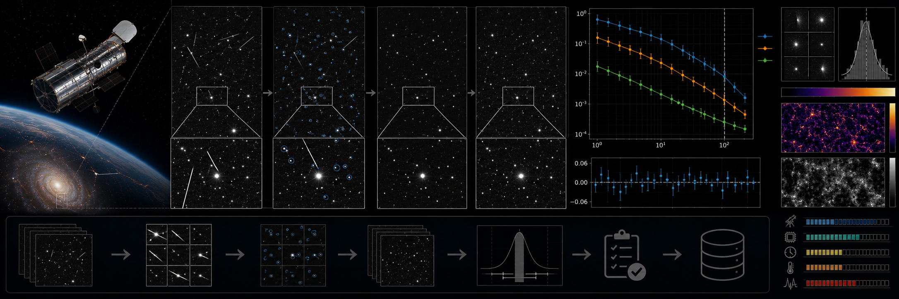

# HST CCD Cosmic-Ray Rejection Benchmark



> **Curation:** `BUILD_FIRST` · Priority 9.3/10 · real HST cutouts + controlled injection

## Scientific question

How do cosmic-ray rejection parameters trade detection recall against false masking and aperture-flux bias on HST CCD images?

## What this repository contributes

A controlled benchmark with injected ground truth; not a replacement for Astro-SCRAPPY, deepCR, Cosmic-CoNN or HST pipelines.

## Key result

On 600×600 central cutouts of two real ACS/WFC exposures, with 40 injected cosmic-ray events per trial and 146 real DAOStarFinder-detected sources per exposure, recall stayed perfect (1.00) across every swept `sigclip` value from 3.0 to 10.0. But precision, PSF-core false-masking, and aperture-flux bias were all far worse on real data than on a clean synthetic demonstration field at every matched `sigclip` value:

| sigclip | recall | precision | PSF-core false-masking | flux frac. bias |
|---|---|---|---|---|
| 3.0  | 1.00 | 0.007 | 0.325 | −0.912 |
| 4.5  | 1.00 | 0.015 | 0.261 | −0.881 |
| 6.0  | 1.00 | 0.022 | 0.221 | −0.854 |
| 8.0  | 1.00 | 0.028 | 0.194 | −0.824 |
| 10.0 | 1.00 | 0.035 | 0.177 | −0.796 |

(means across the two real exposures; synthetic-field comparison: precision 0.21→1.00, PSF false-masking 0.00 throughout, flux bias within ±1e-4.) Detection sensitivity is not the bottleneck on real data — the real cost is false-masking of genuine sources and biased photometry, driven by real-image effects the synthetic benchmark alone does not capture. Both the injection-recovery gate and a null control (no injected cosmic rays, <2% false-positive rate) passed.

## Reproducing this result

```bash
python -m venv .venv
# Windows PowerShell
.venv\Scripts\Activate.ps1
python -m pip install -e ".[dev]"
pytest -q
python scripts/run_analysis.py --demo
python scripts/make_figures.py --demo
```

The demo path above uses clearly-labelled synthetic data for a fast smoke test. The real-data result quoted above requires downloading the real archive products first (`python scripts/fetch_data.py --i-have-authorization --n-exposures 2`), then `python scripts/run_analysis.py` and `python scripts/make_figures.py` without `--demo`.

For the web dashboard:

```bash
cd web-react
npm install
npm run dev
```

## Research documentation

- `CURATION_STATUS.md`
- `docs/RESEARCH_BLUEPRINT.md`
- `docs/DATASET_PLAN.md`
- `docs/LITERATURE_SEEDS.md`
- `docs/VALIDATION_CONTRACT.md`
- `docs/FIGURE_AND_UI_SPEC.md`

## Reproducibility and FAIR practice

All real inputs require product IDs, retrieval times, checksums, source terms and deterministic selection manifests. Derived results record the software commit and configuration hash.

## Limitations

- A controlled benchmark with injected ground truth on real cutouts; not a replacement for Astro-SCRAPPY, deepCR, Cosmic-CoNN, or HST's own pipeline.
- The real sample is two exposures with 600×600 central cutouts, a bounded first-release check rather than a survey-scale characterization.
- Precision/false-masking/flux-bias values on real data should not be compared directly to the clean synthetic benchmark as if they measured the same thing — the gap itself is the finding.

## Author

Biswajit Jana

## Licence

BSD-3-Clause for original code. Mission/archive products retain their original terms.
